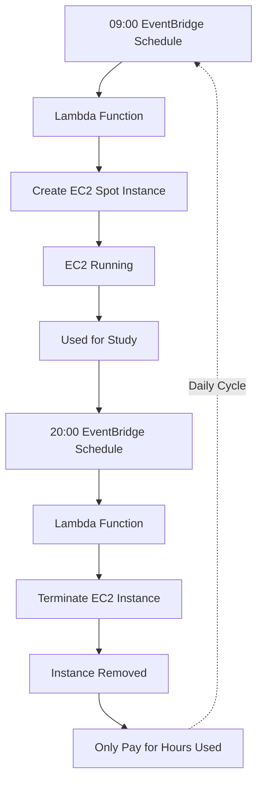

# Objective
- CREATE A BASE EC2 INSTANCE FLOW FOR FUTURE STUDIES

# EC2

1. Create launch-template
2. Create security group policy
3. Test the EC2 start and terminate

# LAMBDA

1. Create a lambda role
2. Create the managed policies
3. Attach the inline policy and the managed policy to the role
4. Create the lambda function zip
5. Create and test the lambda function

# SCHEDULER

1. Create the schedule role
2. Create the policies and attach to the role
3. Create the start schedule
4. Create the terminate schedule

# MERMAID

 
 

# CURRENT BILLING

| Item                                                       |               Estimate |
| ---------------------------------------------------------- | ---------------------: |
| EC2 t3.micro Spot: 334.6 hrs × $0.0029/hr                  |           **$0.97/mo** |
| EBS root volume, likely 8 GB × $0.08/GB-mo × 11/24 runtime |          **~$0.29/mo** |
| Lambda/EventBridge                                         |             **~$0.00** |
| **Total**                                                  | **~$1.25–$1.50/month** |
