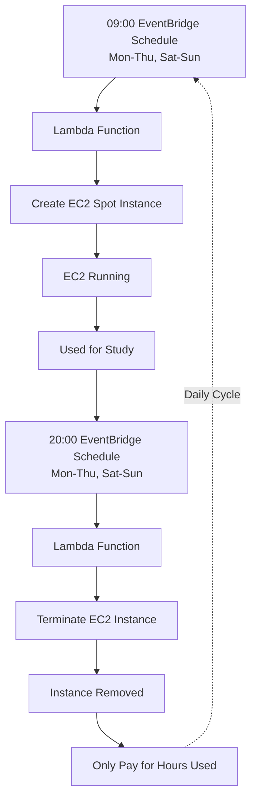

# FLOW

 
 

# CURRENT BILLING

| Item                                                       |               Estimate |
| ---------------------------------------------------------- | ---------------------: |
| EC2 t3.micro Spot: 334.6 hrs × $0.0029/hr                  |           **$0.97/mo** |
| EBS root volume, likely 8 GB × $0.08/GB-mo × 11/24 runtime |          **~$0.29/mo** |
| Lambda/EventBridge                                         |             **~$0.00** |
| **Total**                                                  | **~$1.25–$1.50/month** |

# UHANKU.COM

| Monthly full visits | CloudFront transfer | CloudFront requests | Estimated bill |
| ------------------: | ------------------: | ------------------: | -------------: |
|               1,000 |            0.079 GB |               6,000 |     **~$0.00** |
|              10,000 |            0.791 GB |              60,000 |     **~$0.00** |
|             100,000 |            7.914 GB |             600,000 |     **~$0.00** |
|           1,000,000 |            79.14 GB |           6,000,000 |     **~$0.00** |
|           2,000,000 |           158.28 GB |          12,000,000 |     **~$2.40** |
|          10,000,000 |           791.40 GB |          60,000,000 |    **~$60.00** |
